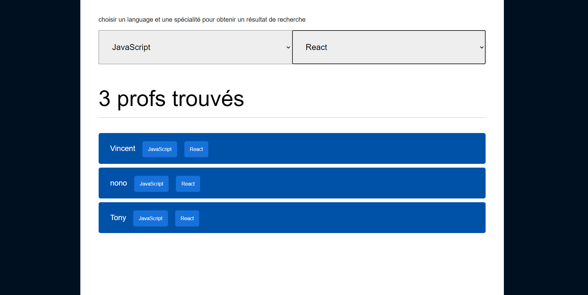

# Exercice de manipulation du DOM en vanilla JS

### Exercice simple consistant à filtrer un fichier JSON à l'aide de deux éléments de type 'select' 

### L'ensemble des éléments du DOM sont générés en vanilla JS.

### les éléments de la liste seront effacés et recréers à chaque tri ( approche de la programmation déclarative )

## apercu
